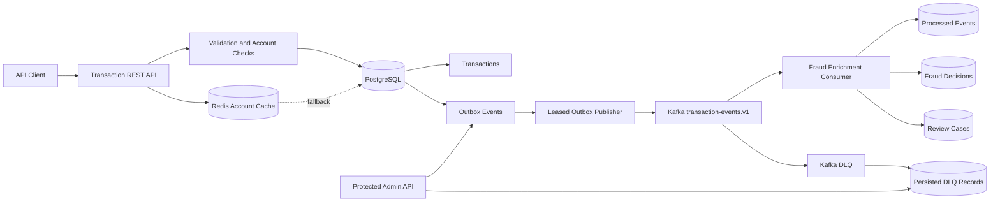

# Fraud Detection Pipeline

A Java 17 backend that demonstrates failure-safe transaction intake,
asynchronous fraud evaluation, and operational recovery using Spring Boot,
PostgreSQL, Kafka, and Redis.

The project focuses on five backend reliability scenarios:

| Failure scenario | Reliability control |
|---|---|
| Database commit succeeds but Kafka is unavailable | Transactional outbox |
| Client retries the same transaction | Idempotency key with canonical request fingerprint |
| Kafka redelivers a message | Durable processed-event claim |
| Consumer receives malformed or poison payload | Persisted DLQ inspection and controlled replay |
| Redis is unavailable | PostgreSQL fallback with Redis treated as cache only |

This is a synthetic portfolio project. It contains no employer code,
production data, customer data, credentials, or confidential architecture.

## Architecture



## End-to-end processing flow

1. A client submits a transaction with an idempotency key.
2. The API validates the request and performs account and limit checks.
3. The transaction and versioned event are committed atomically using the transactional outbox pattern.
4. A leased publisher claims pending outbox rows.
5. The publisher sends the event to Kafka and updates the outbox state.
6. The fraud consumer checks whether the event has already been processed.
7. The consumer stores a fraud decision and optionally creates a manual-review case.
8. Failed events are retried and eventually routed to the DLQ.
9. Operators can inspect and replay DLQ or outbox records through API-key-protected endpoints.

## Technology stack

| Category | Technology |
|---|---|
| Language | Java 17 |
| Framework | Spring Boot 3.2 |
| API | Spring MVC, Bean Validation, OpenAPI/Swagger |
| Persistence | PostgreSQL, Spring Data JPA, Flyway |
| Messaging | Apache Kafka |
| Cache | Redis |
| Testing | JUnit 5, Mockito, Testcontainers, RestAssured, Awaitility |
| Quality | JaCoCo, Spotless, Google Java Format, SpotBugs |
| Observability | Spring Boot Actuator, Micrometer, Prometheus |
| Runtime | Docker, Docker Compose |
| CI | GitHub Actions |

## Quick start

### Prerequisites

Install:

- Java 17 or newer
- Docker Desktop
- Git

Maven installation is not required because the repository includes Maven Wrapper.

### Start the complete environment

```bash
docker compose --profile app up --build -d
```

Check container status:

```bash
docker compose ps
```

Check application health:

```bash
curl http://localhost:8081/actuator/health
```

Expected response:

```json
{
  "status": "UP",
  "groups": [
    "liveness",
    "readiness"
  ]
}
```

Open Swagger UI:

```text
http://localhost:8081/swagger-ui.html
```

The Docker Compose environment starts:

- PostgreSQL
- Redis
- ZooKeeper
- Kafka
- Fraud Detection API

The local admin API key is:

```text
local-admin-key
```

This key is for local demonstration only.

## API demonstration

### Submit a low-risk transaction

```bash
curl -X POST http://localhost:8081/api/v1/transactions \
  -H "Content-Type: application/json" \
  -H "X-Correlation-Id: portfolio-demo-001" \
  -d '{
    "idempotencyKey": "portfolio-low-001",
    "accountId": "acct-low",
    "amount": 500.00,
    "currency": "USD"
  }'
```

A successful first request returns HTTP `201 Created`.

The asynchronous fraud decision can then be retrieved using the returned transaction ID:

```bash
curl http://localhost:8081/api/v1/fraud/decisions/{transactionId}
```

The low-risk scenario produces an approval decision.

### Submit a high-risk transaction

```bash
curl -X POST http://localhost:8081/api/v1/transactions \
  -H "Content-Type: application/json" \
  -H "X-Correlation-Id: portfolio-demo-002" \
  -d '{
    "idempotencyKey": "portfolio-high-001",
    "accountId": "acct-high",
    "amount": 12000.00,
    "currency": "USD"
  }'
```

This scenario produces:

- an upstream `REVIEW_REQUIRED` transaction status
- a fraud decision with a high risk score
- a persisted manual-review case

Review cases are available at:

```bash
curl http://localhost:8081/api/v1/fraud/reviews
```

## Idempotency behavior

The API distinguishes two retry scenarios.

### Same key and same request

Submitting the same payload with the same idempotency key returns the original transaction instead of creating a duplicate.

```text
First request  → HTTP 201 Created
Exact replay   → HTTP 200 OK with the same transactionId
```

### Same key and changed request

Reusing an idempotency key with a changed amount, account, or currency is rejected:

```text
HTTP 409 Conflict
```

This prevents an idempotency key from accidentally representing two different transactions.

## Protected administration endpoints

Requests under `/api/v1/admin/**` require:

```text
X-Admin-Api-Key: local-admin-key
```

Available operations include:

```text
GET  /api/v1/admin/outbox
POST /api/v1/admin/outbox/{id}/replay
GET  /api/v1/admin/dlq
POST /api/v1/admin/dlq/{id}/replay
```

These endpoints demonstrate controlled operational recovery. Production systems would additionally use centralized identity, authorization policies, audit logging, and secret management.

## Testing strategy

The project contains three complementary test layers.

| Test layer | Purpose | Verified tests |
|---|---|---:|
| Unit tests | Fraud rules, service behavior, event contracts, and entity behavior | 6 |
| PostgreSQL integration tests | Concurrent idempotency, durable processing, and outbox leasing with Testcontainers | 3 |
| RestAssured E2E tests | Running Docker API, Kafka flow, fraud decisions, validation, security, and replay conflicts | 5 |
| **Total** |  | **14** |

### Run the standard quality gate

Linux/macOS:

```bash
./mvnw -B -ntp clean verify
```

Windows PowerShell:

```powershell
.\mvnw.cmd -B -ntp clean verify
```

The standard verification lifecycle includes:

- compilation
- unit tests
- PostgreSQL/Testcontainers integration tests
- Spotless formatting verification
- JaCoCo coverage enforcement
- SpotBugs static analysis
- executable Spring Boot JAR packaging

The external E2E suite is intentionally disabled during a normal Maven build because it requires the Dockerized application to already be running.

### Run the E2E suite

Start the stack first:

```bash
docker compose --profile app up --build -d
```

Linux/macOS:

```bash
./mvnw \
  -Dtest=FraudPipelineE2ETest \
  -De2e.enabled=true \
  -De2e.base-url=http://localhost:8081 \
  -De2e.admin-api-key=local-admin-key \
  test
```

Windows PowerShell:

```powershell
.\mvnw.cmd `
  "-Dtest=FraudPipelineE2ETest" `
  "-De2e.enabled=true" `
  "-De2e.base-url=http://localhost:8081" `
  "-De2e.admin-api-key=local-admin-key" `
  test
```

The E2E suite verifies:

- application health
- low-risk transaction approval
- high-risk transaction blocking
- asynchronous decision polling with Awaitility
- manual-review case creation
- exact idempotent replay
- conflicting replay returning HTTP `409`
- request validation
- correlation-ID propagation
- admin API-key enforcement

## Reliability design

### Transactional outbox

The API does not independently write to PostgreSQL and Kafka. It commits the business transaction and an outbox record together. This avoids losing an event when the database succeeds but Kafka is temporarily unavailable.

### Leased publishing

Outbox publishers claim rows using database locking and leases. Multiple workers can process separate batches without selecting the same rows during normal operation.

### At-least-once delivery

The design accepts that Kafka events may be delivered more than once. Correctness is enforced by the consumer’s durable processed-event record rather than by assuming exactly-once delivery.

### Dead-letter handling

Consumer failures are retried before routing exhausted events to the DLQ. A dedicated listener persists raw failed payloads, including malformed messages, for inspection and replay.

### Redis fallback

Redis is treated as a performance optimization. When cache access fails, the service falls back to PostgreSQL instead of making correctness depend on cache availability.

## Observability

Useful endpoints include:

```text
GET /actuator/health
GET /actuator/metrics
GET /actuator/prometheus
```

Application logs include correlation IDs:

```text
[correlationId=portfolio-demo-001]
```

Reference service-level objectives and alerting recommendations are documented in:

- [`docs/slo-and-alerts.md`](docs/slo-and-alerts.md)
- [`docs/runbook.md`](docs/runbook.md)

## Project structure

```text
.
├── contracts/                  Event schema contracts
├── docs/
│   ├── adr/                    Architecture decision records
│   ├── runbook.md              Operational troubleshooting
│   ├── slo-and-alerts.md       Reliability targets and alerts
│   └── sequence-duplicate-delivery.md
├── performance/                Performance-test notes and assets
├── src/main/java/              Application source
├── src/main/resources/         Configuration and Flyway migrations
├── src/test/java/              Unit, integration, and E2E tests
├── docker-compose.yml          Local distributed environment
├── Dockerfile                  Multi-stage production image
└── pom.xml                     Build, dependencies, and quality gates
```

## Architecture decisions

The repository includes documented decisions for the most important correctness patterns:

- [Durable consumer idempotency](docs/adr/0001-durable-consumer-idempotency.md)
- [DLQ persistence and replay](docs/adr/0002-dlq-replay.md)
- [Duplicate-delivery sequence](docs/sequence-duplicate-delivery.md)

## Suggested study path

For a code walkthrough, read the implementation in this order:

```text
TransactionController
→ TransactionService
→ TransactionInsertService
→ OutboxPublisher
→ FraudEnrichmentConsumer
→ FraudDecisionService
→ DlqPersistenceConsumer
→ DlqReplayService
```

Additional guides:

- [`docs/code-walkthrough.md`](docs/code-walkthrough.md)
- [`docs/reliability-design-decisions.md`](docs/reliability-design-decisions.md)
- [`CHANGELOG.md`](CHANGELOG.md)
- [`CONTRIBUTING.md`](CONTRIBUTING.md)

## Known limitations

This project demonstrates production patterns but is not presented as a production banking system.

- Fraud scoring uses deterministic demonstration rules rather than a trained model.
- The local admin API uses a shared API key instead of enterprise identity and role-based authorization.
- Kafka and PostgreSQL run as single local instances without production replication.
- Event compatibility is documented through a JSON schema but not enforced by a centralized schema registry.
- Leasing reduces duplicate publishing but does not mathematically eliminate it; downstream consumer idempotency remains the correctness guarantee.
- DLQ replay should be performed only after the underlying failure has been corrected.


## Security and data statement

All accounts, transactions, decisions, credentials, and operational scenarios in this repository are synthetic.

See [`SECURITY.md`](SECURITY.md) for vulnerability-reporting guidance.

## License

This project is available under the [MIT License](LICENSE).
