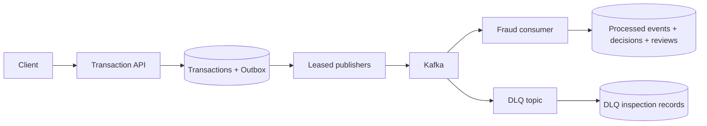

# Fraud Detection Pipeline

A Java 17/Spring Boot transaction-intake and Kafka fraud-enrichment project focused on durable correctness rather than a log-only messaging demo.

> Synthetic portfolio project. It contains no employer code, production data, architecture, credentials, or confidential information.

## Architecture in 30 seconds

- The API performs must-stop account/limit checks and concurrency-safe request idempotency.
- Transaction plus versioned event commit in one database transaction through a transactional outbox.
- Leased publishers use `FOR UPDATE SKIP LOCKED`, bounded Kafka waits, retry/backoff, and operator replay.
- The consumer atomically persists a durable processed-event marker, fraud decision, and optional review case.
- Exhausted consumer errors route to a DLQ. A dedicated raw-text listener persists even malformed payloads with deterministic topic/partition/offset identity, and OPEN records can be replayed through an API-key-protected endpoint.
- Redis is a shared low-latency account cache, not a correctness store; PostgreSQL remains the fallback source of truth.



## Run

### Full local stack

```bash
docker compose --profile app up --build
```

API: `http://localhost:8081`  
Swagger: `http://localhost:8081/swagger-ui.html`  
Local admin key: `local-admin-key`

### IDE/Maven mode

The `dev` profile uses H2 and seeds two synthetic accounts. Start Redis and Kafka, then run Maven:

```bash
docker compose up -d redis kafka
./mvnw spring-boot:run
```

```bash
curl -X POST http://localhost:8080/api/v1/transactions \
  -H 'Content-Type: application/json' \
  -H 'X-Correlation-Id: fraud-demo-1' \
  -d '{"idempotencyKey":"tx-demo-1","accountId":"acct-low","amount":150.00,"currency":"USD"}'
```

## Test and quality gates

```bash
./mvnw verify
```

This runs unit tests, Docker-available PostgreSQL/Testcontainers tests, JaCoCo, and SpotBugs. CI builds the Docker image; Kubernetes reference manifests are under `deploy/k8s/`.


## Repository quality gates

```bash
./mvnw spotless:apply   # only when you intentionally reformat Java
./mvnw verify           # formatting, tests, coverage, and static analysis
```

GitHub Actions runs backend verification, dependency review, and a Docker-image build. Java source is formatted with Google Java Format 1.20.0 through Spotless, so the formatter used locally and the formatter enforced in CI are identical.

## Study path

Read `TransactionService` → `TransactionInsertService` → `OutboxPublisher` → `FraudDecisionService` → `FraudEnrichmentConsumer` → `DlqPersistenceConsumer`. Then use [`STUDY_GUIDE.md`](STUDY_GUIDE.md), [`UPGRADE_NOTES.md`](UPGRADE_NOTES.md), the ADRs, the runbook, and [`docs/slo-and-alerts.md`](docs/slo-and-alerts.md).

## Known limitations and production evolution

This is a portfolio implementation of real patterns, not a production system. Specific gaps, honestly:

- **Fraud rules are deterministic demonstrations**, not a trained model. `FraudDecisionService` applies a threshold rule so the enrichment/decision pipeline has something real to do — a production system would call a scoring service or model here.
- **Leasing reduces but does not eliminate duplicate publishing.** A worker can claim an outbox row, have its lease expire mid-publish (slow Kafka), lose the row to another worker, and still complete its own publish afterward. The `@Version` optimistic-lock column prevents the two workers from corrupting the row's bookkeeping, but it does not prevent both Kafka sends from happening. This is acceptable only because downstream consumers (`FraudEnrichmentConsumer`) are idempotent via the `processed_events` table — the lease is a throughput optimization, not the correctness guarantee.
- **DLQ replay requires operational authorization and monitoring** — `DlqReplayService` will happily replay a bad message in a loop if the underlying cause isn't fixed first; there's no automatic circuit-breaking on repeated replay failures.
- **Event-schema governance is local to this repository.** `contracts/transaction-event-v1.schema.json` documents the event shape, but there's no schema registry enforcing compatibility across services the way there would be in a real multi-team org.
- **Redis and Kafka are explicitly not sources of truth** — Postgres is. Redis failures fall back to the DB; Kafka publish failures leave the outbox row `PENDING` for retry rather than losing the event.
