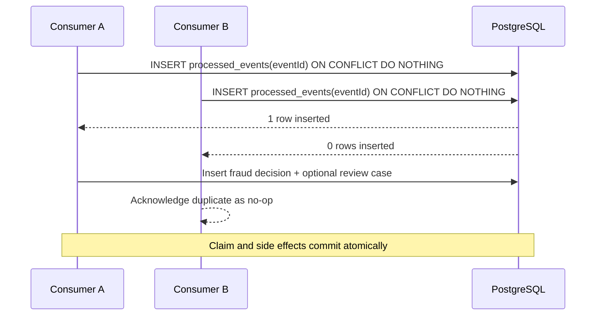

# Sequence: concurrent duplicate Kafka delivery

```mermaid
sequenceDiagram
  participant C1 as Consumer A
  participant C2 as Consumer B
  participant DB as PostgreSQL
  C1->>DB: INSERT processed_events(eventId) ON CONFLICT DO NOTHING
  C2->>DB: INSERT processed_events(eventId) ON CONFLICT DO NOTHING
  DB-->>C1: 1 row inserted
  DB-->>C2: 0 rows inserted
  C1->>DB: Insert fraud decision + optional review case
  C2-->>C2: Acknowledge duplicate as no-op
  Note over C1,DB: Claim and side effects commit atomically
```
